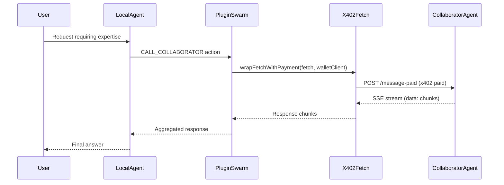

# Plugin Swarm

x402-powered plugin for Bino agents to call collaborator agents with blockchain micropayments.

## Overview

The `plugin-swarm` plugin enables Bino agents to collaborate with other agents through x402-protected endpoints. When an agent needs expertise beyond its own capabilities, it can call collaborator agents using the `CALL_COLLABORATOR` action, which automatically handles x402 micropayments for each request.

## Prerequisites

- **EVM_PRIVATE_KEY**: Required environment variable containing a private key for an EVM-compatible wallet
- **Funded wallet**: The wallet must have enough payment assets to pay that the target x402 endpoint requires (commonly a stablecoin such as USDC)
- **Collaborator agents**: Target agents must expose the `/message-paid` endpoint (x402-protected)

## Chain support

`plugin-swarm` is **IoTeX-based by default** with future plans to support other EVM chains.

## Configuration

### Enable plugin + configure collaborators

```json
{
  "name": "MyAgent",
  "plugins": ["@elizaos/plugin-swarm"],
  "collaborators": [
    {
      "name": "SpecialistAgent",
      "url": "https://agent.example.com/agent-uuid",
      "expertise": "Blockchain analysis and smart contract auditing"
    },
    {
      "name": "CodeReviewer",
      "url": "https://host:3000/agent-uuid-2",
      "expertise": "Code review and security analysis"
    }
  ]
}
```

You can configure **multiple collaborators**. `CALL_COLLABORATOR` will choose one based on the current task and the collaborators’ `expertise`.

**Important**: The `collaborators[].url` field must include the full path including the agent ID. For example:

- Correct: `https://host:3000/agent-uuid`
- Incorrect: `https://host:3000` (missing agent ID)

The plugin will append `/message-paid` to construct the full endpoint URL.

### Environment Variables

Set the required environment variable:

```bash
EVM_PRIVATE_KEY=0x...
```

## How It Works

1. The agent determines it needs collaborator assistance
2. The `CALL_COLLABORATOR` action is triggered
3. A wallet client is created using the `EVM_PRIVATE_KEY`
4. The request is wrapped with `wrapFetchWithPayment` from `x402-fetch`
5. A POST request is sent to `${collaboratorUrl}/message-paid`
6. The response is streamed back as Server-Sent Events (SSE)

### Request Flow


